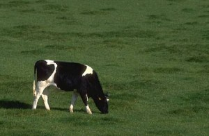
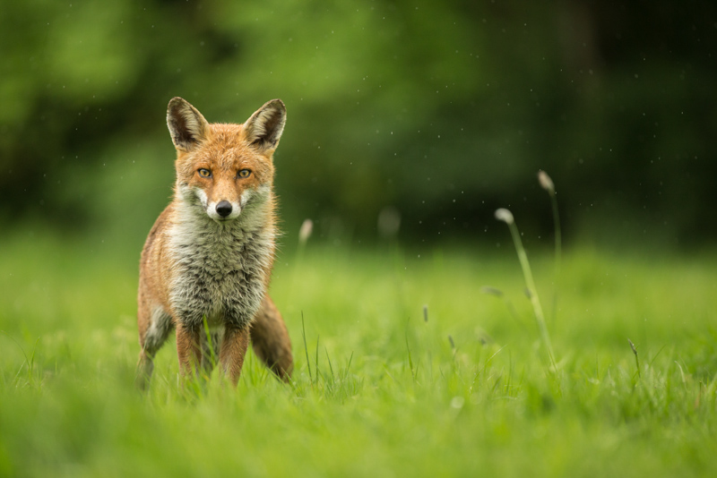
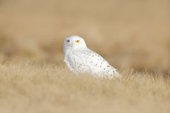
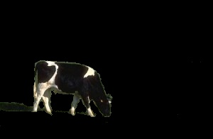
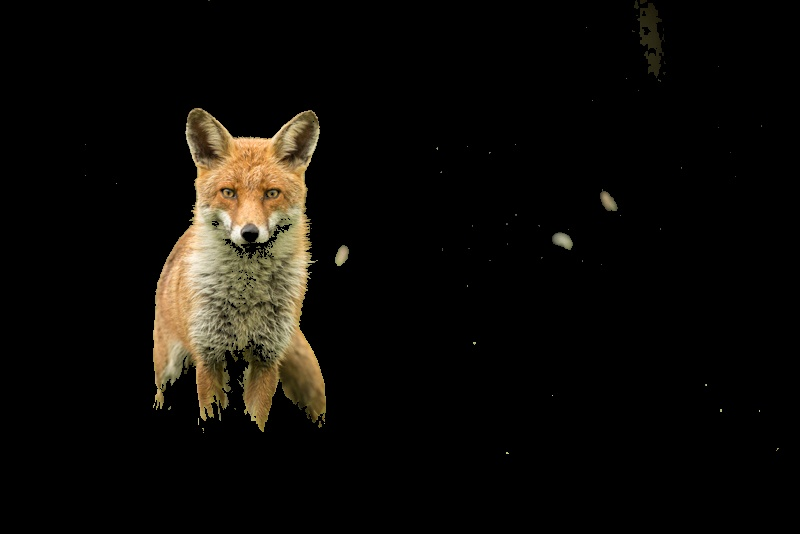
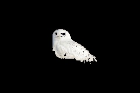
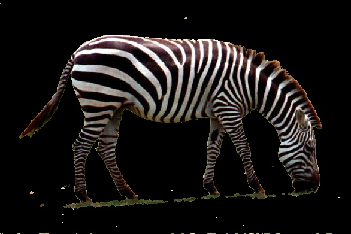

# Image Object Detection Using GMM and the *Expectation-Maximization Algorithm*

This project was done for a class assignment at SUTD for Machine Learning. io_data.py was provided for me as well as the image data in .jpg and .txt format. The rest of the code and implementation was written by me. Start by initializing the env by running ``python3 -m venv env`` then run ``source env/bin/activate`` then run ``pip install -r requirements.txt``. Then either run as a Jupyter Notebook with the env kernel or run ``python3 main.py``. The output will be the segmented images.

## Implementation

My implementation use the given read_data() function to collect the LAB color values for ach pixel. It is then converted to a numpy array of ${n}$ by IdI dimensions. ${n}$ being the number of pixels in the image and ${d}$ being 3 for each of the LAB values. I then initialize my weights, mean, and covariances with the kmeanInitialization() function. This function uses the one iteration of k means to Cluster each of the points. From there the weights are initialized by $\frac{n_k}{n}$ for each value of ${k}$ where ${k}$ is 2 for the number of objects. In this case background and subject. The mean is initialized by taking the average of the individual ${L}$, ${A}$, and ${B}$ values ofr each cluster. The covariance is initialized the same way with the variance formula. 

Once the initialization step is done it goes into a loop that checks for convergence Then the *E-step occurs*. In the *E-step* the responsibilities are calculated using the weights multiplies by the probability distribution function. This is done column by column where each column is an attribute ${k}$. Then I divide each row by the sum of the rows values to get a soft classification where the classified one will approach 1 and the unclassified one will approach 0.

Moving into the *M-step*, I then need to update the respective means, covariances, weights and get the log likelihood to try and maximize that. This is done with the formulas in the slides and similar to the way they were initialized in the first place. Once the values are updated, I check for convergence eby comparing the old likelihood with the ne one.
Once the loop is complete, I have a function that gets all of the labels and updates the image data with the according ***LAB*** values for the *write_data()* function. Those values are either their originals if it is the unmasked part or black if it is masked. In the main function, data is collected and stored in jpg with the *read_data()* function.

Overall, this is a more probabilistic wya to approach k means. By using a probability distribution function and soft assignments it is less harsh than k means would be with its classifications functions. It allows for better generalization. Some updates and changes I had to make along the way were the k mean initialization was originally initialized with random centroids in the data. However, I made it so the algorithm would get stuck in a local minimum that wasn't a good classification. I decided to hard code initialization values that would lead to the right minimum and the results improved dramatically. The output images are shown in results. 

## Results

### Input

### Output

